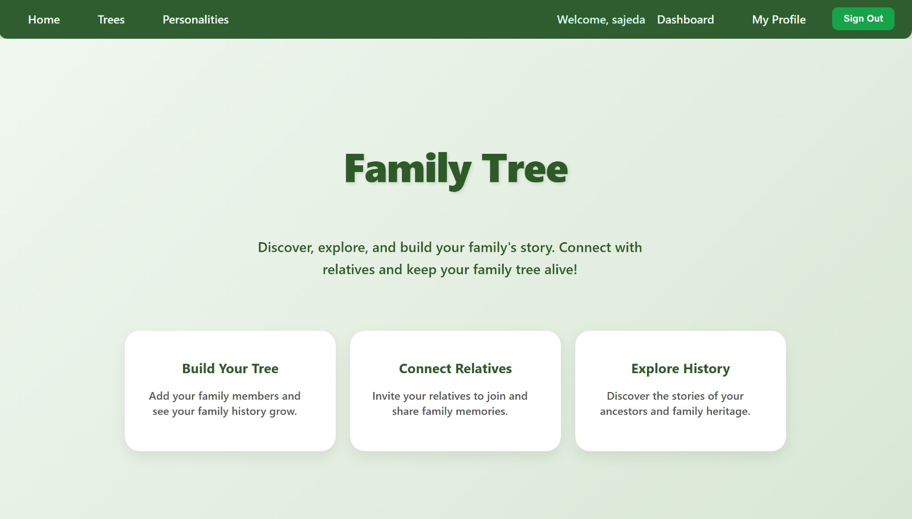
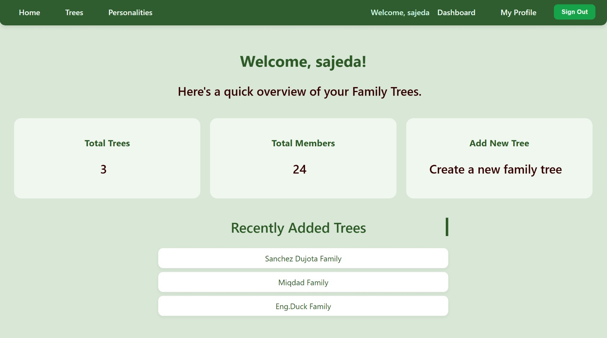
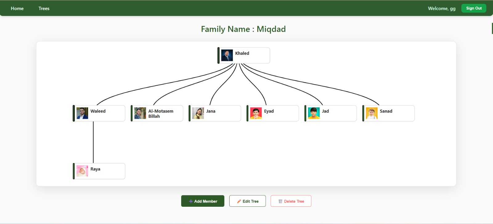
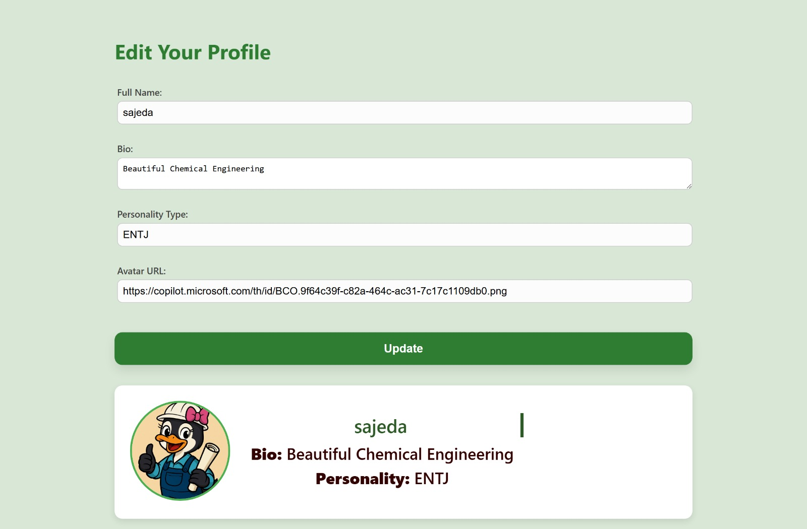

# Project 3 : Family-Tree_Frontend

## Screenshot/Logo :

## App's name:

Family Tree Application.
The website allows users to create a family tree consisting of a group of members (“Grandparents", "Parents", "Son", "Daughter"). If the user is a member, he is allowed to view all existing trees, edit , and delete them. Members can also view all members within a single tree, edit their information, and delete them. However, if the user is not a member, they will only be able to view the available data.

## Getting started:

Link to the ERD :

Link to the back-end repository :
[ link](https://github.com/SajedaHussain/Family-Tree-Backend/tree/main)

## Attributions:

external resources such as libraries or assets.
libraries used :

- react-d3-tree
- sweetalert2

## Technologies used:

- JavaScript.
- HTML.
- CSS .
- JSC.
- JSX
- Google Gemini

## Next steps:

Planned future enhancements :

- If we had more time, we would add colors to the node borders — pink for girls and blue for boys — and make twin nodes connected together.
- Add a search bar for finding the family trees easier .
